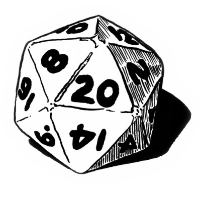
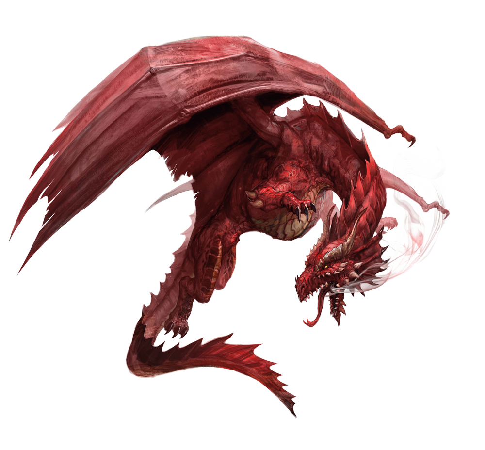

+++
draft = false
date = 2025-04-09T15:57:32-08:00
title = "The Joy (and Pain) of Writing"
slug = "the-joy-and-pain-of-writing"
authors = ["Dakota Raine"]
categories = [
    "writing",
    "worldbuilding",
    "D&D",
    "TTRPG"
]
externalLink = ""
series = []
+++

 Almost 17 years ago, my college buddy *(a dude named "Munch")* dropped one of the greatest games in my lap when he offered the chance to play my very first Dungeons & Dragons adventure. The 4th edition of the game had just been released and this was a pretty big deal from what I could discern amidst all the talk of proficiency, at-will powers, AC, and other game-specific jargon that was being thrown around by all the other *(more knowlegeable)* members of my gaming group. We were all friends from college, but I was apparently the only nerd of our little entourage that had never played before. Since that time, 5th edition - which dropped in 2014 - has seen over 10 years of play and my taste for gaming has changed drastically in terms of which aspects I appreciate and how I show that appreciation. Some of it is just a *(mechanical)* change in the way I play the game... But the biggest difference seems to be my audience.

 When I first jumped into the world of TTRPGs, it was hard enough to wrap my head around the concept of collective storytelling through roleplay *(let alone any mention of running my own homebrew adventure/campaign)*. My focus was on having a bad-ass character and that meant taking the term "min-max" to its limits *(which was actually pretty low, given the difficultly of breaking anything in 4th edition)*. Almost 20 years later and I've discovered depths to worldbuilding and personal exploration that dwarf my younger self's understanding of the game by a significant margin. Unfortunately, that time for discovery came with some undesirable consequences... Namely, the loss of human connection that made those first few adventures feel so significant and meaningful. Granted, I have new connections, but -as we age - availability is not an issue relegated solely to matters of scheduling a game.

Watching shows like Dimension 20 has rekindled a passion for storytelling that I havenn't felt this strongly in decades, especially with shows like Fantasy High and The Unsleeping City. For the same reasons that I love these shows *(primarily the anti-capitalist messaging)*, I'm having a difficult time finding a game to play. Mind you, I'm not trying setting my expectations for DM performance on Brennan Lee Mulligan's level. But I do - at least - want a game where the DM cares as much about their world as I do... A DM who's outgrown silly notions of nobility and generally harmful ones like biological essentialism/determinism *(which D&D has always been packed full of)*. Since I haven't been able to find a DM like that, I've decided to write my own adventures.

I've got a number of ideas that I'm working on and they have kept/will keep my busy as I continue to work on them. I'll release them on this site as I complete theme and I look forward to getting y'alls input.

Much love, y'all!
